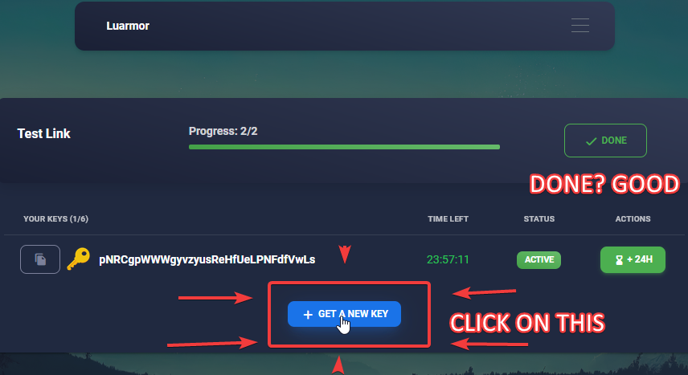
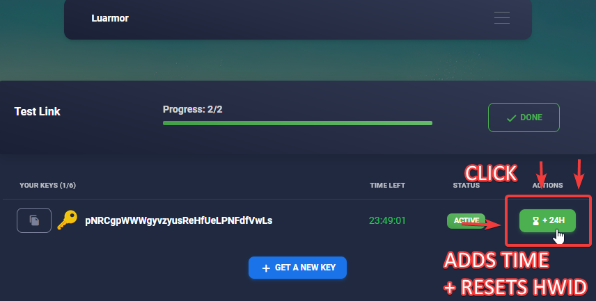
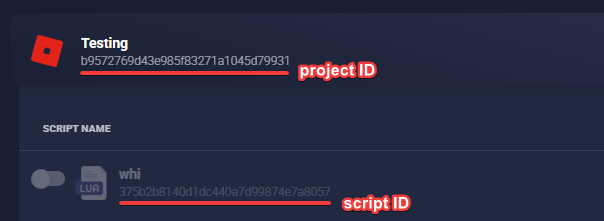

import AdRewardsSteps from "/snippets/ad_rewards_steps.mdx"
import ScriptIssue from "/snippets/script_issue.mdx"

When using Luarmor, you may come across some errors or issues. This page will help you troubleshoot and solve common problems. If your issue is not listed here, please contact our support team.

This page is split into two parts, one for script owners and another for script users. Please make sure you are reading the correct section

## Script Users

If you want an executor, we recommend [Nucleus](https://nucleus.rip)!

### Getting a key (Ad Rewards)

<AccordionGroup>
    <Accordion title="How to get a key?">
        <AdRewardsSteps/>   
        Now, press "+ GET A NEW KEY"

        Your new key should now appear, simply press the copy button and use it within the script.

        If an error appears, please read the rest of the FAQ.
        If your error is not answered on this page, please create a ticket in our [Discord server](https://discord.gg/luarmor).

        
    </Accordion>

    <Accordion title="It does not let me get a new key">
        <AdRewardsSteps/>

        If you already have a key, you need to renew it.
        If you are on mobile, swipe left on the key, and under "ACTIONS", press the orange button with the text "RENEW".

        If you do not have a key, press "+ GET A NEW KEY"

        If an error appears, please read the rest of the FAQ.
        If your error is not answered on this page, please create a ticket in our [Discord server](https://discord.gg/luarmor).
    </Accordion>

    <Accordion title="How to reset my HWID?">
        <AdRewardsSteps/>
        
        If you are on mobile, swipe left on the key, and under "ACTIONS", press the green button with an hourglass symbol that has the text "+H".
        That button will add time onto your key and reset your HWID.

        If that option is not available, the script owner has disabled it and you must contact them for further help.
        
    </Accordion>

    <Accordion title="Problem with target redirection">
        > There is a problem with target redirection, therefore your result can not be verified at the moment.
        > You can create a ticket in gg/luarmor and send this screenshot.
        > You can also try incognito tab to fix it.

        If you get the error above, try the following steps:

        <Steps>
            <Step title="Try again in a private/incognito tab">
                As the error tells you, try to complete all of the checkpoints again within an incognito or private tab.
                If you do not know what that is, please [Google](https://google.com) how to.
            </Step>
            <Step title="Try another device">
                If the previous step did not work, try again on another device.
                For example, on a **different** computer or phone.
            </Step>
            <Step title="Try another network">
                If a different device did not help, try again using a VPN or on your mobile data.
            </Step>
            <Step title="Use a different script">
                If all of the above did not work, it's possible that the script you want to use has not been configured correctly.
                Try contacting the script owner.
                If multiple people have the same issue as you, **consistently**, then the script owner needs to fix it themselves.
                
                However, if you are the only one, there's nothing else to be done.
                In that case, please try a different script entirely.
            </Step>
        </Steps>
    </Accordion>

    <Accordion title="You need to connect your discord account">
        > You need to connect your discord account to perform this action.
        > Please reload the page.

        As the error says, reload the page and you will be asked to connect your Discord account.

        If it does not work, follow these steps:

        <Steps>
            <Step title="Reload the page">
                Reload the page, it should bring you to the Discord website.

                **Do not press anything else.**
            </Step>
            <Step title="Copy the link">
                While on the Discord site, copy the link you were redirected to.
            </Step>
            <Step title="Send the link on Discord">
                Go onto Discord and paste the link into **any** chat.
            </Step>
            <Step title="Open the link">
                Open the Discord link from inside the Discord app.
                This should ensure Discord recognises your account.
            </Step>
        </Steps>
    </Accordion>
</AccordionGroup>

### Blacklisted (Ad Rewards)
<AccordionGroup>
    <Accordion title="Why did I get blacklisted?">
        You were **temporarily** blacklisted from **all** Luarmor ad links for one of the following reasons:

        <Steps>
            <Step title="Bypass service">
                You have been detected using a bypass service for the ad links.
                Notable examples include:

                - [bypass.city](https://bypass.city)
                - [bypass.vip](https://bypass.vip)
                - [linkunlocker](https://linkunlocker.com)
            </Step>
            <Step title="Userscript or plugin">
                <Warning>
                    It does not matter if you used it or not.
                    It is a valid blacklist regardless, if detected.
                </Warning>

                A userscript or plugin was detected on the Luarmor page that is known for bypassing.
                Notable examples include:

                - [Tampermoney](https://www.tampermonkey.net/)
                - [Violentmonkey](https://violentmonkey.github.io/)
                - [Luperly](https://luperly.fun/)
            </Step>
            <Step title="Bypassing a link created by the Luarmor ad system">
                If you bypass any links created by the Luarmor ad system, you may get blacklisted.
                Some links may include, but is not limited to:
                
                - [work.ink](https://work.ink)
                - [lootlabs](https://lootlabs.gg)
                - [linkvertise](https://linkvertise.com)
            </Step>
        </Steps>
    </Accordion>
    <Accordion title="I am still blacklisted after trying to do it legit again">
        Luarmor blacklists apply across **all other** Luarmor links.
        This means even if you try again with a different script, you will still be blacklisted.

        You must wait until your blacklist duration has ended before trying to complete other links,
        or else you will get blacklisted again.
    </Accordion>
    <Accordion title="My blacklist is a mistake">
        <Warning>
            When blacklisted, your IP address and current browser session is also blacklisted.
            It's possible another person in your household got you blacklisted, or you were using a VPN.
            In this case, the blacklist **is still** valid, and you must wait the blacklist duration.

            **DO NOT** make a ticket in this case, and **wait** the blacklist duration instead.
        </Warning>

        If you got blacklisted, it likely was **not** a mistake.
        Please do not ask for an unblacklist, unless you are 100% sure that you are in the right.

        Luarmor has state-of-the-art bypass detections, and we can easily tell when you do attempt to bypass.
        If you make a ticket asking to get unblacklisted, when you did bypass, you may get banned from further tickets.

        If you keep getting blacklisted **after** the blacklist duration has expired, and you are doing it legit,
        please try another script.
        The script owner might have set something up wrong.
        If a different script works, please contact the script owner instead.

        If you wish to appeal, please make a ticket inside of the [Discord](https://discord.gg/luarmor) with a screenshot of the blacklist message.
        Make sure that the error code is visible.
    </Accordion>
    <Accordion title="What should I do if I got blacklisted?">
        You **must wait** the blacklist cooldown.

        While you are blacklisted, you can try looking for other scripts that do not use the Luarmor key system.
    </Accordion>
</AccordionGroup>

### Running scripts

<AccordionGroup>
    <Accordion title="Nothing happens after entering the key">
        <ScriptIssue/>
    </Accordion>

    <Accordion title="The script is crashing">
        If the script you are using is crashing when you execute, this is usually an issue with the script itself.
        To check, use another executor.
        If you still crash, please contact the script owner and let them know.

        <ScriptIssue/>
    </Accordion>

    <Accordion title="The script get stuck on 95% Finalizing">
        Within the developer console, if the script gets stuck on 95% Finalizing, try executing a few more times.
        The issue in this scenario is the executor, usually Xeno.

        Please use a different executor like [Nucleus](https://nucleus.rip), a **safe**, 100% sUNC/UNC, keyless executor.
    </Accordion>

    <Accordion title="HttpError: Timedout">
        If you get HTTP errors in the console or kick message, this means there is an issue with your internet.
        To fix the issue, use a VPN or try a custom DNS like [1.1.1.1](https://one.one.one.one/).
    </Accordion>

    <Accordion title="Luarmor V4 loader failed to fetch a chunk: attempt to compare number <= nil">
        If you get HTTP errors in the console or kick message, this means there is an issue with your internet.
        To fix the issue, use a VPN or try a custom DNS like [1.1.1.1](https://one.one.one.one/).
    </Accordion>

    <Accordion title="HWID is too long or too short">
        This error happens because you use a bad spoofer.
        If you are on an emulator, use a different executor or re-generate your HWID.

        However, on Windows, follow these steps:
        1. Press the Windows (⊞) button
        2. Type `cmd`
        3. Right click on "Command Prompt"
        4. Press on "Run as administrator"
        5. Copy and paste the following command, and press enter to run it
        ```
        powershell.exe -Command "Set-ItemProperty -Path 'HKLM:\System\CurrentControlSet\Control\IDConfigDB\Hardware Profiles\0001' -Name 'HwProfileGuid' -Value ([guid]::NewGuid().ToString())"
        ```
        6. Restart Roblox and your executor
    </Accordion>

    <Accordion title="I am blacklisted">
        <Note>
            This only applies when you get kicked when **running** the script, not the ad rewards system.
        </Note>

        If the blacklist is permanent and tells you to appeal within the Luarmor discord, this is because your IP address is blacklisted.
        In this case, if you are on a VPN, turn it off and on to change your IP address.
        If you are not on a VPN, and you truely believe its false, then make a ticket in [the Discord](https://discord.gg/luarmor).

        In all other cases, the script owner is the only person that can unblacklist you.
        **Luarmor staff cannot unblacklist a project-based blacklist** placed either automatically or by the script owner.
        **Please contact the script owner instead**.
        It is also possible that your HWID is banned on another key, while your actual key is not banned.
        Again, talk to the script owner about this.
    </Accordion>
</AccordionGroup>

### Miscellaneous

<AccordionGroup>
    <Accordion title="What is Luarmor?">
        Luarmor is a service for people who want to make scripts.
        It adds a whitelist onto your script and obfuscates everything.
        If you are here wanting to use scripts, you are in the wrong place.
        You likely came here from the Luarmor Ad Rewards.
        If you are having issues with the Ad Reward system then please tell us.
        Otherwise, contact the script owners.
        However, since Luarmor has so many customers, we cannot tell you who they are.
        You must find the script owners yourself.
    </Accordion>
    <Accordion title="Help, I've been scammed!">
        <Warning>
            Failure to provide enough proof will result in your ticket being closed without any further investigation, and possibly a ban.
            It's **very** important that you provide as much information as possible when opening the ticket, instead of us having to ask you for it.
        </Warning>

        Unfortunately, our support staff cannot help you with this and it's very unlikely we will be able to investigate much.
        However, if you open a ticket and provide **FULL** details, then we may be able to help you.
        
        Please provide:
        - the scammer's username
        - the scammer's Discord server
        - proof of purchase
        - proof of denial of service
        - and any other relevant information that can strengthen your case
    </Accordion>
    <Accordion title="I've found a way to detect Luarmor">
        Before you get too excited, please enable "Silent Mode" in the script and check whether the detection still works.
        If it does, then please report it to us and let us know that you have silent mode enabled.
    </Accordion>
    <Accordion title="I want to add support for my executor">
        <Warning>
            If you exploit is external or uses Xeno as a base, you will not get support.

            In this case, your only option is to:
            1. Set `identifyexecutor` to return the same as Xeno
            2. Use `Xeno-Fingerprint`
            3. Set the `User-Agent` the same as Xeno
        </Warning>
        <Steps>
            <Step title="Follow UNC">
                - Follow the [UNC for the request function](https://github.com/unified-naming-convention/NamingStandard/blob/main/api/misc.md#headers), including headers.
                - Follow the [UNC for identifyexecutor too](https://github.com/unified-naming-convention/NamingStandard/blob/main/api/misc.md#identifyexecutor)
            </Step>
            <Step title="Headers">
                <Note>
                    Each field inside `Roblox-Session-Id` **must** have the value of `game.JobId`.
                    However, `Roblox-Game-Id` and `Roblox-Session-Id` are optional.
                </Note>

                <Accordion title="For game:HttpGet">
                    - `User-Agent` = `Roblox/WinInet`
                    - `Roblox-Game-Id` = `game.JobId`
                    - `Roblox-Session-Id` = `{"GameId": game.JobId, ...}` (as JSON string)
                </Accordion>
                <Accordion title="For request">
                    - `User-Agent` = `Exploit/Version` or `Exploit Android/Version` or whatever you want, you must let us know first so we can whitelist it
                    - `Roblox-Game-Id` = `game.JobId`
                    - `Roblox-Session-Id` = `{"GameId": game.JobId, ...}` (as JSON string)
                </Accordion>
            </Step>
            <Step title="Run compatibility script">
                <Note>
                    WebSocket support is optional but recommended.
                </Note>

                Run [this script](https://github.com/Gork3m/RobloxStuff/blob/main/luarmor_compatibility_test.lua) and make sure everything is successful.
            </Step>
            <Step title="Report the results to us">
                <Warning>
                    If the script fails at any point, make sure to check F9 and report that too.
                </Warning>
                The previous step should have copied the result to your clipboard.
                Paste this in a **support** ticket in the [Discord server](https://discord.gg/luarmor) and we will review it.
            </Step>
        </Steps>
    </Accordion>
</AccordionGroup>

## Script Owners

### Purchasing

<AccordionGroup>
    <Accordion title="How long does crypto payments take">
        Crypto payments from [the official site](https://luarmor.net/crypto) can take 10-60 minutes.
        Make sure you send the exact amount, accounting for fees.

        If you send insufficient funds, you will get an email about it.
        In that event, make a ticket and we can invite you manually.
    </Accordion>
    <Accordion title="How much is the Enterprise plan?">
        $120 USD monthly, crypto only.
    </Accordion>
    <Accordion title="Is there lifetime?">
        Luarmor does not sell lifetime in any circumstance.
        However, you can bulk buy invite codes to get yearly, for example.

        Please make a ticket if you want a discount on bulk invite codes.
    </Accordion>
</AccordionGroup>

### Account management

<AccordionGroup>
    <Accordion title="I didn't receive/lost my API key">
        Make sure to check your (spam) email from an email from Luarmor.
        If you cannot find it, please request the API key to be sent to you [via email](mailto:contact@luarmor.net).
    </Accordion>
    <Accordion title="I want to change something about my account">
        If you want to change your email, Discord ID, request account deletion, etc., please do [via email](mailto:contact@luarmor.net).
    </Accordion>
</AccordionGroup>

### Uploading scripts

<AccordionGroup>
    <Accordion title="How do I set all of this up?">
        Please read the following information:
        - [Quickstart guide](./quickstart.mdx)
        - [Ad rewards guide](https://docs.luarmor.net/ad-system-rewards)
        - [Discord bot guide](./discord-bot.mdx)
    </Accordion>
    <Accordion title="Luau is not fully supported">
        While Luraph supports Luau fully, Luarmor does not.
        Therefore, you must remove some Luau features from your script before uploading it to Luarmor.
        
        This includes:
        - any types
        - inline ternary via `if` statement:
        ```lua
        -- this does not work
        local maxValue = if value > 10 then 10 else value end

        -- instead, use:
        local maxValue
        if value > 10 then
            maxValue = 10
        else
            maxValue = value
        end
        ```

        For more information, view the Luau docs [here](https://luau-lang.org/syntax).

        <Accordion title="Automatically support via darklua">
            <Steps>
                <Step title="Go to the playground">
                    A web version of darklua can be accessed [here](https://darklua.com/try-it/?configuration=%7B%22rules%22%3A%5B%22convert_luau_number%22%2C%22remove_comments%22%2C%22remove_compound_assignment%22%2C%22remove_interpolated_string%22%2C%22remove_if_expression%22%2C%22remove_types%22%5D%7D).
                </Step>
                <Step title="Paste your code">
                    Paste your code into the left box.
                </Step>
                <Step title="Press the format button">
                    To ensure everything worked, press the "Configure" button, then press the "format" button on the left panel
                </Step>
                <Step title="Copy the code">
                    <Note>
                        Press `CTRL + A` to select all, then `CTRL + C` to copy, instead of manually selecting the code.
                    </Note>

                    Copy the code from the right box and paste it into Luarmor.
                </Step>
            </Steps>
        </Accordion>
    </Accordion>
    <Accordion title="The line count isn't making sense / matching up">
        Luarmor adds its own code before obfuscation which changes the line count.
        Therefore the line count is not accurate and unreliable.
    </Accordion>
    <Accordion title="I cannot make a new project">
        Projects are like folders for your scripts.
        You need to upgrade your plan if you have reached your limit.
        
        Note that keys are project scoped, meaning a person with a key within a project can execute all scripts inside that project (folder).
    </Accordion>
    <Accordion title="How to make a key system GUI?">
        You can use [this template](https://github.com/Luckyware-Softworks/Example-Ad-Reward-Loader).
    </Accordion>
    <Accordion title="Where is the script ID and project ID">
        
    </Accordion>
</AccordionGroup>

### Running scripts

<AccordionGroup>
    <Accordion title="Your script isn't working">
        To test whether it's an issue on your end or Luarmor's, make sure "Silent Mode" is disabled in the script settings.
        If you see that Luarmor has successfully authenticated in F9 console, then the issue is 100% with your script.
        If you see a Luarmor error, please refer to these docs or ask for support, if your issue is not here.
    </Accordion>
    <Accordion title="My script keeps crashing">
        This is 100% an issue with your script.
        However, [script optimisations](./scripting/optimisation.mdx) may help.
    </Accordion>
    <Accordion title="attempt to index thread with 'Send'">
        This happens due to a bad websocket implementation within the exploit that is being used.
        
        To fix this, either:
        - use a different executor
        - ask the script owner to disable the "Heartbeat" feature in their script
    </Accordion>
    <Accordion title="My modules don't work with Luarmor">
        Luarmor does not return the main function.
        This means returning anything at the end of the script is not supported.
        To fix this, you need to assign your module to a global variable.
    </Accordion>
    <Accordion title="hook has more upvalues than original">
        This error happens due to obfuscation.
        To fix it, call `LPH_NO_UPVALUES` on your `hookfunction`'s hook as shown below in the before and after.
        
        Note this is an example!
        
        ```lua
        local old
        old = hookfunction(f, function(...)
            return old(...)
        end)
        ```

        ->

        ```lua
        local old
        old = hookfunction(f, LPH_NO_UPVALUES(function(...)
            return old(...)
        end))
        ```

        If you are still having issues, make sure the argument you give to `LPH_NO_UPVALUES` is a constant function, not a variable.
        If you want to assign a name to the function, you can do something like this:

        ```lua
        local old
        local FunctionNameHere = LPH_NO_UPVALUES(function(...)
            -- code
            return old(...)
        end)

        old = hookfunction(f, FunctionNameHere)
        ```
    </Accordion>
</AccordionGroup>


### Discord bot

<AccordionGroup>
    <Accordion title="This bot can't join more servers">
        Ensure that you have tried ALL of the available bots listed [here](https://luarmor.net/bot).
        If none are addable, please wait for us to upload a new bot which you can use.
    </Accordion>
    <Accordion title="Failed to compensate">
        This error happens when one of the keys has an expiration that may overflow the 32-bit integer limit.
        Essentially, make sure every key has an expiration before 2038.
        If you want a key to last forever (lifetime), then do not set an expiration date.
    </Accordion>
    <Accordion title="Remove role for ad rewards (free users)">
        If you want to disallow free users from getting your premium user role, you need to make a different project just for them.
        Remember that keys are project based.
    </Accordion>
</AccordionGroup>

### Miscellaneous

<AccordionGroup>
    <Accordion title="Can I get Luarmor for free for my script?">
        The likely answer is no.
        Only people who will primarily be using the ad rewards system, **and** get over 10,000 daily completions are eligible.
        However, just because you are eligible, does not mean you will get it for free.

        If you believe you are eligible, please make a ticket on the [Discord](https://luarmor.net/discord) with proof of your completions and Discord server in the following format: .gg/whatever.
    </Accordion>
    <Accordion title="Can I get Luarmor for free for my executor?">
        First, please refer to [this section on getting support](./faq-troubleshooting.mdx#miscellaneous) (under "I want to add support for my executor"), to get initial support.
        From there, you are only eligible for free Luarmor if your executor is primarily free with ads, i.e. users can complete ad steps to receive a 12h+ temporary key.

        If you believe you are eligible, please make a ticket on the [Discord](https://luarmor.net/discord) with your Discord server in the following format: .gg/whatever.
    </Accordion>
</AccordionGroup>